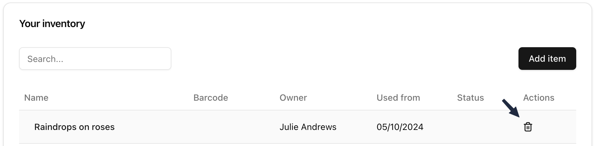

# Personal inventory

## Introduction

This is a proof of concept for an application to allow the recording of your own personal inventory - the items that you own.

The backend uses Django, DRF, and Pytest. The frontend is developed with Vite, React, Tanstack Router, Axios, React Hook Form, and Tailwind CSS.

Separate repositories have been created for the backend and the frontend.

## Features

### Registration with validation


### Login with validation


### Add items with validation


### Datepicker for ease of use


### View a list of items


### Inferred fields


### Search the list


### Delete items from the list



### Detail view (read-only)


### Detail view (edit)


### Event list for traceability


## Getting started

### Backend

#### Running the development server

Clone the repository.

```shell
git clone git@github.com:parradam/personal-inventory-backend.git
```

Install dependencies.

```shell
pip install -r requirements.txt
```

Navigate to the `src` directory.

```shell
cd src
```

Run the development server.

```shell
python manage.py runserver
```

The server should be available at port 8000.

#### Linting

Precommit hooks are set. `ruff` and `ruff-format` are used.

#### Testing

Run unit and integration tests.

```shell
pytest
```

### Frontend

#### Running the development server

```shell
git clone git@github.com:parradam/personal-inventory-frontend.git
```

Navigate to the `frontend` directory.

```shell
cd frontend
```

Run the development server.

```shell
npm run dev
```

The server should be available at port 5173.

#### Linting

Precommit hooks are set.

`lint-staged` can be used to run `eslint` and `prettier` on staged files.

```shell
npx lint-staged
```

## Contributing

Feel free to contribute by forking the repository, following the existing conventions on branch naming, and then opening a pull reuqest.

## License

This project is licensed under the MIT License - see the [LICENSE](./LICENSE) file for details.
